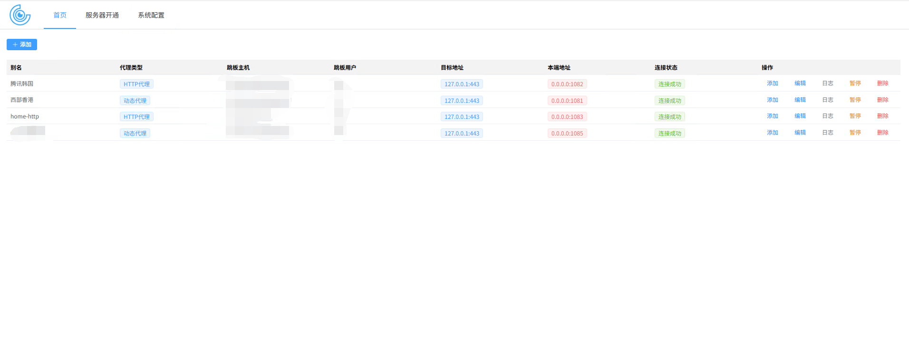
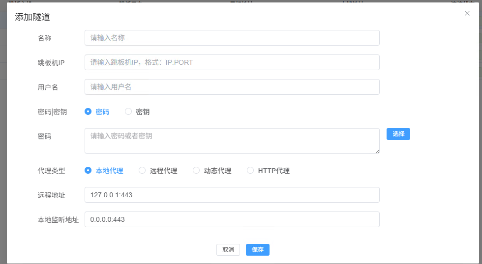

# SSH Proxy Plus

[](https://golang.org)
[](LICENSE)
[](https://github.com/helays/ssh-proxy-plus/releases)
[]()

SSH Proxy Plus 是一个基于 Go 语言构建的企业级多层级 SSH 代理与隧道管理平台。它集成了四种核心转发模式，提供可视化配置界面，适用于复杂的网络穿透、安全访问和服务暴露场景，为企业网络架构提供灵活、安全的隧道解决方案。

---

## ✨ 核心特性

### 🔗 多层级代理链

- **智能拓扑编排**：支持无限级 SSH 代理链，实现多层网络穿透与流量路由。
- **可视化拓扑管理**：通过 Web 界面拖拽或配置"下一跳"关系，直观构建代理网络拓扑。

### 🚀 四种代理转发模式

#### 1. **本地转发（Local Forwarding）**

> 将远程服务端口安全映射至本地，实现内网服务透明访问。

- **适用场景**：访问企业内部数据库、Web 服务、API 等。
- **典型用例**：将远程 MySQL（3306）映射到本地 `127.0.0.1:13306`。
- **优势**：客户端无需额外配置，直接使用本地连接。

#### 2. **远程转发（Remote Forwarding）**

> 将本地服务通过 SSH 隧道暴露至公网，实现内网穿透。

- **适用场景**：临时公网演示、远程调试、本地开发环境暴露。
- **典型用例**：将本地 `localhost:8080` 通过跳板机暴露为公网可访问服务。
- **优势**：无需公网 IP 或端口映射，快速实现服务外网访问。

#### 3. **动态转发（Dynamic Forwarding）**

> 创建 SOCKS5 代理隧道，实现全局流量加密转发。

- **适用场景**：企业网络审计、跨区域访问、网络隔离环境下的安全通信。
- **典型用例**：通过远程服务器建立 SOCKS5 代理访问企业内部资源。
- **优势**：支持 HTTP/HTTPS/FTP 等多种协议，客户端配置简单。

#### 4. **HTTP 代理（HTTP Proxy）**

> 基于 SSH SOCKS5 隧道封装的专用 HTTP/HTTPS 代理服务，提供更友好的 Web 访问体验。

- **适用场景**：浏览器代理、Web 应用访问、企业内网 Web 资源访问。
- **典型用例**：将 SOCKS5 代理转换为标准 HTTP 代理，方便浏览器和 Web 工具直接使用。
- **优势**：兼容标准 HTTP 代理协议，无需额外 SOCKS5 客户端支持，支持连接复用与请求过滤。

---

## 🎯 典型应用场景

| 场景             | 推荐模式              | 核心价值                       |
| ---------------- | --------------------- | ------------------------------ |
| **远程办公**     | 本地转发 + 代理链     | 安全、稳定访问企业内部服务     |
| **开发调试**     | 远程转发              | 快速将本地服务暴露至公网供测试 |
| **安全通信**     | 动态转发（SOCKS5）    | 全流量加密、避免监听与劫持     |
| **Web 访问代理** | HTTP 代理             | 浏览器友好、无需特殊客户端支持 |
| **多云/混合云**  | 混合模式 + 多级代理链 | 跨云服务互联、统一访问入口     |
| **跨区域访问**   | 代理链 + 动态转发     | 安全访问不同地理位置的内部资源 |

---

## 📦 环境要求

- **编译环境**：Go 1.24+（后端）、Node.js 18+（前端）
- **运行环境**：Linux / macOS / Windows（跨平台支持）
- **数据库**：SQLite3（默认，支持其他关系型数据库）
- **依赖工具**：Make（可选，用于自动化构建）

---

## 🛠️ 技术栈

| 组件         | 技术选型                              |
| ------------ | ------------------------------------- |
| **后端**     | Go（标准库 `ssh`、`net/http`）        |
| **前端**     | TypeScript + Vite + Vue               |
| **数据库**   | SQLite（默认，支持 MySQL/PostgreSQL） |
| **构建工具** | Make + Go Build + npm                 |

---

## 🚀 快速开始

### 1. 构建前端

```bash
cd frontend
npm install
npm run build
```

> 前端构建输出目录默认为 `dist/html`，可在 `vite.config.ts` 中配置。

### 2. 使用 Makefile 构建后端

本项目提供完整的 Makefile 构建系统，支持多种架构和构建模式：

#### 📦 构建目标概览

| 目标               | 说明                            | 适用场景                      |
| ------------------ | ------------------------------- | ----------------------------- |
| `make frontend`    | 仅构建前端资源                  | 前端开发、快速测试            |
| `make build-arm`   | 构建 ARM 架构 Linux 版本        | ARM 服务器、嵌入式设备        |
| `make build-arm64` | 构建 ARM64 架构 Linux 版本      | ARM64 服务器、苹果 M 系列芯片 |
| `make build-amd64` | 构建 AMD64 架构 Linux 版本      | 标准 Linux 服务器             |
| `make build`       | **默认构建**：前端 + AMD64 后端 | 标准生产环境构建              |
| `make build-*-dev` | 开发版本构建（带 `dev` 标签）   | 开发调试、功能测试            |

#### 🚀 快速构建示例

```bash
# 标准生产构建（前端 + AMD64 后端）
make build

# 特定架构构建
make build-arm64     # ARM64 架构
make build-arm       # ARM 架构

# 开发版本构建
make build-amd64-dev # AMD64 开发版本
make build-arm64-dev # ARM64 开发版本

# 仅构建前端
make frontend
```

#### ⚙️ 构建参数说明

- **版本号生成**：自动从 Git 标签生成，可通过 `TAG_PARTS` 参数调整
- **输出文件命名**：`proxy-plus-{架构}[{编译模式}]-{版本号}`
- **输出目录**：构建产物位于 `./runtime/build/` 目录

#### 🔍 自定义构建示例

```bash
# 使用三部分版本号
TAG_PARTS=3 make build-amd64

# 查看构建环境
make env
```

### 3. 手动编译后端（备用方案）

```bash
# 如果不想使用 Makefile，也可以手动编译
go build -o ssh-proxy-plus cmd/main.go
```

### 4. 配置与运行

```bash
./ssh-proxy-plus -c conf.yaml
```

### 5. 访问管理界面

- 浏览器打开：[http://localhost:19009](http://localhost:19009)
- 功能包括：
  - 创建 SSH 代理连接
  - 配置代理链与转发规则
  - 启动/停止代理、查看实时日志与连接状态

---

## ⚙️ 配置示例

```yaml
common:
  cache: ./runtime/cache
  heart_beat: 10s
  ssh_timeout: 30s
  enable_pass: false
  enable_ali_ecs: true
  log_ring_buffer_size: 1024

http_server:
  listen_addr: :19009

router:
  router:
    default: "index.html"
    root: ./dist/html
    http_cache: false
    http_cache_max_age: 25920000
    session_id: "_ssh"
    unauthorized_resp_method: 401

db:
  db_type: sqlite
  host:
    - "proxy.db"
  dbname: helay.blog
  timeout: 10000
  max_idle_conns: 1
  max_open_conns: 1

session_config:
  session_engine: db  # memory, file, db
  session_file_path: runtime/sessions

session:
  cookie_name: "vsclub.ltd"
  check_interval: "1h"
  carrier: "cookie"
  http_only: true
```

---

## 📸 界面预览

| 主页概览                   | 代理配置界面               |
| -------------------------- | -------------------------- |
|  |  |

---

## 🧩 使用场景示例

### 场景一：多级跳板访问内网服务

```
本地 → 跳板机 A → 跳板机 B → 目标服务器（如数据库、内网应用）
```

### 场景二：本地开发端口映射

将远程数据库（`10.0.0.10:3306`）安全映射至本地 `localhost:13306`，便于本地工具直接连接。

### 场景三：构建企业级 Web 访问代理

通过 SSH 隧道建立 SOCKS5 代理，并封装为 HTTP 代理，为企业员工提供统一、安全的 Web 访问入口。

---

## ⚠️ 注意事项

### 部署建议

- 使用 **systemd**、**supervisord** 或 **Docker** 进行进程守护与自动重启。
- 若服务监听非 `localhost`，请配置防火墙规则，限制访问来源。

### 构建说明

- **版本管理**：建议每次发布前创建 Git 标签，确保版本号正确生成
- **构建缓存**：构建产物位于 `./runtime/build/` 目录，可定期清理
- **多架构支持**：支持 x86_64、ARM64、ARM 等多种 CPU 架构

### 日志与监控

- 启动后请查看服务日志，确认代理连接状态。
- 支持日志环形缓冲区，避免日志文件无限制增长。

### 已知限制

- 目前仅支持 **TCP** 协议转发，**UDP** 暂不支持。
- 代理链过长可能增加延迟，建议根据实际网络拓扑优化层级。
- HTTP 代理功能基于 SOCKS5 隧道封装，性能可能略低于原生 HTTP 代理。

---

## 🤝 贡献指南

我们欢迎任何形式的贡献，包括但不限于：

- **提交 Issue**：请提供复现步骤、环境信息及相关日志。
- **提交 Pull Request**：
  1. Fork 本仓库。
  2. 基于 `main` 分支创建功能分支：`git checkout -b feat/your-feature`。
  3. 遵循 Go 代码规范（运行 `go fmt`、`go vet`），补充相应测试。
  4. 提交 PR 并详细描述变更内容、测试情况及兼容性影响。
- **文档与示例**：欢迎补充部署示例（Docker Compose、K8s YAML）、Web UI 使用指南等。

---

## 📄 许可证

© helays, 2024–present

本项目基于 [MIT License](LICENSE) 开源。
